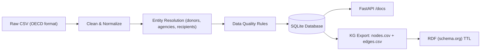

# 🇫🇷 France Development Grants — Open Data & Knowledge Graph Pipeline

> **Live Docs:** https://france-grants.onrender.com/docs  
> **Goal:** Prototype an open data service that answers:  
> _How much development assistance did France provide to African countries for health?_

This project builds a **reproducible, open pipeline** for development-finance transparency — aligned with the data-governance and civic-tech practices used by **ONE Data** and **Data Commons**.

---

## Objectives

| Objective | Completed |
|---|---|
Extract raw grant data | ✅ OECD-style CSV ingestion  
Normalize and standardize entities | ✅ Ministry / agency canonical mapping  
Data quality enforcement | ✅ Null, type, non-negative checks  
Store clean dataset | ✅ SQLite  
Serve as public API | ✅ FastAPI + Swagger  
Export Knowledge Graph | ✅ CSV triples (nodes + edges)  
RDF alignment | ✅ Turtle generator (schema.org-ready)  

---

## 🏗️ Architecture

---

## 🛠️ Infrastructure & Deployment

For users who want a production-grade, cloud-native pipeline, this repository includes a complete Medallion Architecture (Bronze → Silver → Gold → KG) implemented with:

- Google Cloud Storage (Bronze layer)
- BigQuery (Silver/Gold/KG layers)
- GitHub Actions CI/CD
- Python extraction/load + SQL transformations

 See the full GCP Medallion + Knowledge Graph pipeline in [cloud/](cloud/) — diagrams, SQL models, automated deploy workflows, and reproducible ELT jobs are documented in `cloud/infra/README.md`.

---

## 🧠 AI Agent (RAG + LLM Reasoning)

For intelligent, conversational exploration of the data, the repository includes an **agentic RAG system** that:

- **Perceives** queries and classifies them (KG lookup, summary stats, or open-ended RAG)
- **Plans** execution steps dynamically
- **Executes** knowledge graph lookups, vector search, and LLM summarization
- **Scores** confidence and logs traces for auditability

**Tech Stack:**
- Vector search: ChromaDB + Sentence Transformers (MiniLM-L6-v2)
- LLM: Groq FREE tier (llama-3.1-8b-instant)
- UI: Streamlit web app

**Example queries:**
- "Which African countries received health funding from France?"
- "How much did France spend on health in Africa?"
- "Explain France's health aid strategy in Africa"
- "How many grants are there?”

➡️ See [src/agent/README.md](src/agent/README.md) for detailed documentation on the agentic pipeline, perception logic, and execution flow.

---

## 🙌 Acknowledgements

Inspired by datasets and methodologies from:

- OECD
- ONE Campaign
- Data Commons

Thanks to the communities and organizations that maintain these datasets and standards.

---

